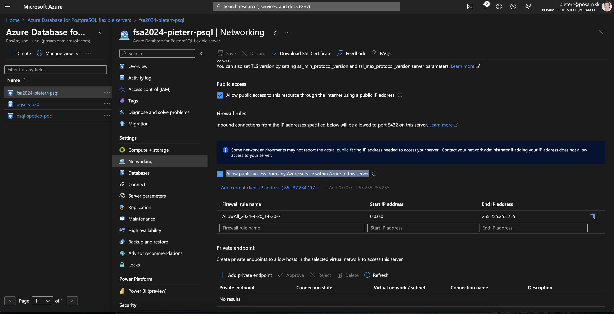

# FSA Workshop — Instructor Setup

Kroky, ktoré školiteľ vykoná pred workshopom: infraštruktúra → Kubernetes → GitLab.

---

## 1. Infraštruktúra

Postup → [`terraform/README.md`](../terraform/README.md) a [`cookiecutter/README.md`](../cookiecutter/README.md).

Súhrn:

```sh
# Jednorazovo (prvý ročník / po zmazaní common infraštruktúry)
cd terraform/00-fsa-common && terraform init && terraform apply

# Každý ročník
cd terraform/01-fsa-rg && terraform init && terraform apply
cd terraform/02-fsa-acr && terraform init && terraform apply
cd terraform/03-fsa-aks && terraform init && terraform apply
cd terraform/04-fsa-pip && terraform init && terraform apply
op run --env-file=.env terraform -chdir=terraform/05-fsa-psql apply
cd terraform/06-fsa-dns && terraform init && terraform apply
cd terraform/07-fsa-automation && terraform init && terraform apply

# Študentská infraštruktúra (RG, ACR, AKS, PIP, PSQL)
cd cookiecutter
chmod +x generate_configurations.sh
./generate_configurations.sh
chmod +x provision_all.sh
./provision_all.sh
```

### Manuálne kroky po terraform apply

- **`00-fsa-common`** (jednorazovo) — Client Secret + NS záznamy:

  ```sh
  cd terraform/00-fsa-common
  terraform output dns_zone_name_servers
  ```

  Skopíruj 4 NS záznamy a nastav ich u registrátora (`fullstackacademy.sk` → Správa DNS → NS záznamy). Počkaj na propagáciu (~1 hodina). Overenie:

  ```sh
  dig fullstackacademy.sk NS @8.8.8.8
  ```

  Vygeneruj aj Client Secret: Azure Portal → `App Registrations` → `fsa-gitlab` → `Certificates & secrets` → ulož do 1Password (vault: FullStackAcademy, item: `FSA - Gitlab SP`)

- **PSQL** — pre každý server (školiteľov aj každého študenta):
  - `psql-fsa-<prefix>` → `Networking` → `Allow public access from any Azure service within Azure to this server` → `Save`



---

## 2. Kubernetes (školiteľ)

Podrobný postup → [`kubernetes/README.md`](../kubernetes/README.md) — sekcia **Školiteľ**.

Súhrn:

```sh
az aks get-credentials --resource-group rg-fsa --name aks-fsa --admin

kubectl apply -f kubernetes/workload/01-namespace.yaml
op inject -i kubernetes/workload/02-secrets.tpl.yaml | kubectl apply -f -

# ingress-nginx, cert-manager, Keycloak — rovnaké príkazy ako u študenta
# (podrobnosti v kubernetes/README.md)

# GitLab
helm upgrade --install fsa-gitlab -n infra \
  -f kubernetes/helm/helm-values/gitlab/values.yaml \
  kubernetes/helm/helm-charts/gitlab/1.0.0/
kubectl apply -f kubernetes/workload/05-ingress/gitlab-ingress.yaml
```

GitLab štartuje prvotne ~10 minút. Stav: `kubectl logs -f -n infra deploy/fsa-gitlab`

---

## 3. GitLab — nastavenie školiteľa

### Prihlásenie

- Adresa: `https://gitlab.fullstackacademy.sk`
- Prihlásiť sa cez **Azure SSO**, kvôli vytvoreniu personalizovaného účtu.
- Prvé prihlásenie: `root` + heslo z 1Password (vault: FullStackAcademy, item: `FSA - Gitlab root`)
  - Odporúčam pridať na svoj personalizovaný účet `admin` oprávnenia kvôli pohodlnosti.
- Ďalej cez **Azure SSO** (tlačidlo `Azure OIDC`)

### Vytvorenie Group

1. **Menu → Groups → New group**
2. Group name: `fsa-<prefix>` (napr. `fsa-pieterr`)
3. Visibility: `Internal`

### Mirror repozitárov

```sh
# Personal Access Token: Edit Profile → Access Tokens → New token
# Scopes: read_repository, write_repository
```


```sh
for REPO in FSA-onion-architecture FSA-angular FSA-infrastructure; do
  git clone https://github.com/posam/$REPO.git
  cd $REPO
  git remote add gitlab https://$(op read "op://FullStackAcademy/FSA - GitLab PAT/username"):$(op read "op://FullStackAcademy/FSA - GitLab PAT/password")@gitlab.fullstackacademy.sk/fsa-<prefix>/$REPO.git
  git push --mirror gitlab
  cd ..
done
```

### Group Runner

1. GitLab: **fsa-`<prefix>` Group → Build → Runners → New group runner**
2. Tag: `fsa`
3. Skopíruj token a ulož do Kubernetes (krok 2 — runner token)


### CI/CD Variables

Nastav v GitLab: **fsa-`<prefix>` Group → Settings → CI/CD → Variables**

| Premenná | Hodnota | Masked |
|---|---|:---:|
| `ACR_REGISTRY` | `acrfsa.azurecr.io` | nie |
| `DOCKER_USERNAME` | `acrfsa` (z Azure Portal → ACR → Access keys) | nie |
| `DOCKER_PASSWORD` | ACR admin password | **áno** |
| `KUBECONFIG_BASE64` | base64 kubeconfig školiteľovho AKS | **áno** |

```sh
az aks get-credentials --resource-group rg-fsa --name aks-fsa --admin --file /tmp/kubeconfig-fsa
cat /tmp/kubeconfig-fsa | base64 | tr -d '\n'
```

---

## 4. Príprava pre študentov

### RBAC — Contributor prístup na RG

Pre každého študenta priraď `Contributor` rolu na jeho Resource Group:

```sh
# az ad user show --id <UPN> --query id -o tsv  # získanie object ID
az role assignment create \
  --assignee <UPN_STUDENTA> \
  --role Contributor \
  --scope /subscriptions/<SUBSCRIPTION_ID>/resourceGroups/rg-fsa-<prefix>
```

### Prístup na FSA Grafana

Pomocou Terraform-u sa vytvorí SP a Skupiny, ktoré sa používajú na prideľovanie
prístupu do Grafana FSA. Priraď študentov do skupiny `Editor`, seba do `Admin`.

### GitLab — skupiny pre študentov

Každý študent si vytvorí vlastnú group sám po prihlásení (viď `SETUP.md`).

### Zdieľanie credentials so študentmi

Každý študent potrebuje pred workshopom dostať:

| Info | Kde nájdeš |
|---|---|
| Subscription ID | Azure Portal → Subscriptions |
| Tenant ID | Azure Portal → Microsoft Entra ID → Overview |
| PSQL admin heslo | 1Password → FSA → `psql-admin` |
| ACR Access keys | Azure Portal → `acrfsa<prefix>` → Access keys |
