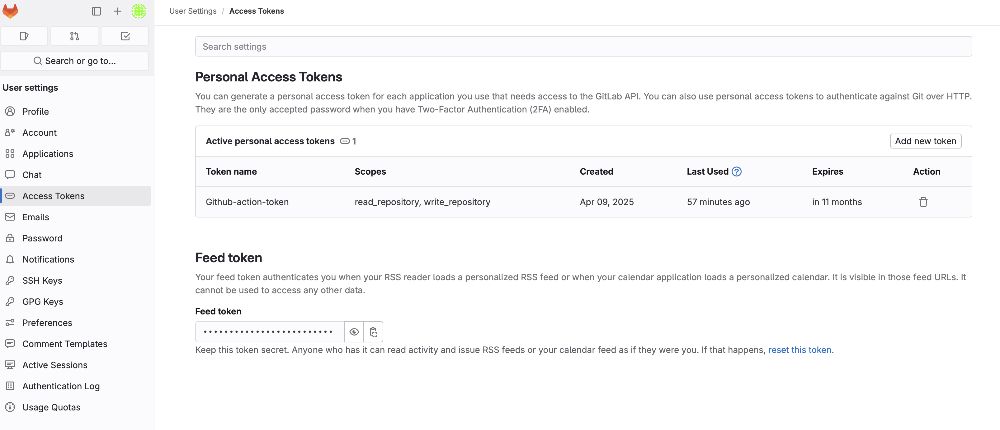
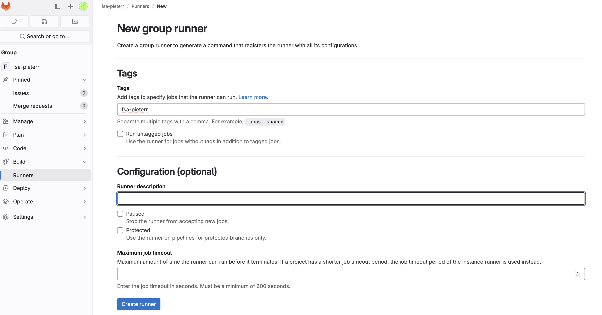
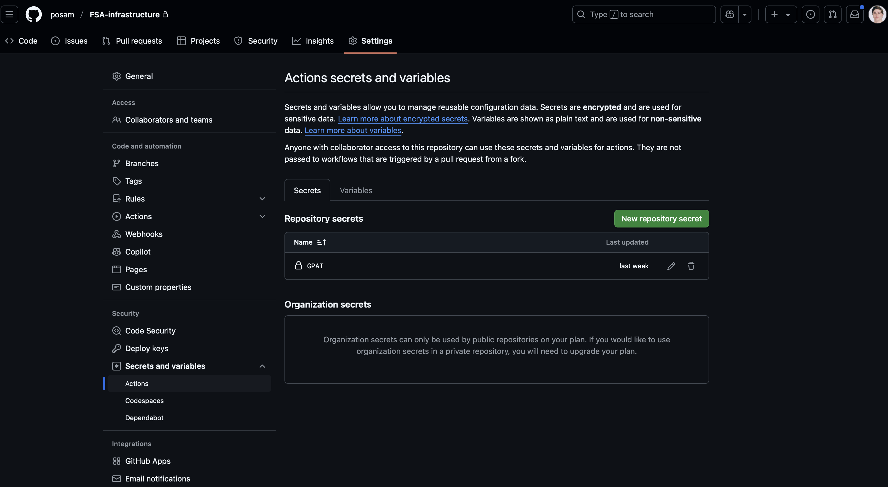

# FSA Workshop — Setup

Postup na nastavenie celého prostredia pre FSA Workshop. Infraštruktúru (AKS, ACR, PSQL, PIP) pripraví školiteľ vopred — ty začínaš priamo Kubernetes nastavením.

---

## Predpoklady

Nainštalované nástroje:

| Nástroj | Na čo |
|---|---|
| `az` | Azure CLI — prihlásenie, kubeconfig |
| `kubectl` | Práca s Kubernetes |
| `helm` | Inštalácia komponentov (Keycloak, Runner, ...) |
| `git` | Práca s repozitármi |
| `docker` | Build a push Docker images |

```sh
az login
az account set --subscription "<SUBSCRIPTION_ID>"
```

---

## 1. Kubernetes

Podrobný postup → [`kubernetes/README.md`](../kubernetes/README.md) — sekcia **Študent**.

Súhrn krokov:

```sh
az aks get-credentials --resource-group rg-fsa-<prefix> --name aks-fsa-<prefix> --admin

kubectl apply -f kubernetes/workload/01-namespace.yaml
kubectl apply -f kubernetes/workload/02-secrets.yaml

# ingress-nginx (uprav override.yaml pred inštaláciou)
helm upgrade --install ingress-nginx ingress-nginx/ingress-nginx -n ingress-nginx --version 4.15.1 \
  -f kubernetes/helm/helm-values/ingress-nginx/override.yaml

# cert-manager
helm upgrade --install cert-manager jetstack/cert-manager -n cert-manager --version 1.20.1 \
  -f kubernetes/helm/helm-values/cert-manager/override.yaml
kubectl apply -f kubernetes/helm/helm-values/cert-manager/letsencrypt-cluster-issuer.yaml

# Keycloak (uprav database.hostname v override.yaml pred inštaláciou)
kubectl apply -f kubernetes/helm/helm-values/keycloak/keycloak-java-config.yaml
kubectl apply -f kubernetes/helm/helm-values/keycloak/realm-fsa-configmap.yaml
helm upgrade --install keycloak -n app codecentric/keycloakx --version 7.1.9 \
  -f kubernetes/helm/helm-values/keycloak/override.yaml
```

> **`02-secrets.yaml`:** Uprav `db_url` — musí odkazovať na `psql-fsa-<prefix>.postgres.database.azure.com`. Hodnoty zakóduješ cez `echo -n "hodnota" | base64`.

---

## 2. GitLab

### Prihlásenie

- Adresa: `https://gitlab.fullstackacademy.sk`
- Prihlásenie cez **Azure SSO** (tlačidlo `Azure OIDC`)

### Vytvorenie Group

1. **Menu → Groups → New group**
2. Group name: `fsa-<prefix>` (napr. `fsa-pieterr`)
3. Visibility: `Private`

### Mirror repozitárov

Pre každý repozitár (`fsa-onion-architecture`, `fsa-angular`, `fsa-infrastructure`):

1. V GitLab Group: **New project → Import project → Repository by URL**
2. Git repository URL: URL z GitHub (napr. `https://github.com/posam/FSA-onion-architecture.git`)
3. Project name: ponechaj pôvodný názov
4. Visibility: `Internal`

Alebo cez git push:

```sh
# Vygeneruj si Personal Access Token v GitLab:
# Edit Profile → Access Tokens → New token (scopes: read_repository, write_repository)
```



```sh
# Priklad pre FSA-onion-architecture repository
git clone https://github.com/posam/FSA-onion-architecture.git
cd FSA-onion-architecture
git remote add gitlab https://<USERNAME>:<GLPAT>@gitlab.fullstackacademy.sk/fsa-<prefix>/fsa-onion-architecture.git
git push --mirror gitlab
```

### Group Runner

Runner beží v tvojom AKS clustri a spracúva CI/CD joby pre celú tvojú group.

1. GitLab: **fsa-`<prefix>` Group → Build → Runners → New group runner**
2. Tag: `fsa`
3. Skopíruj vygenerovaný token



Ulož token do Kubernetes a nasaď runner:

```sh
kubectl create secret generic gitlab-runner-secret \
  --from-literal=runner-token=<TOKEN> \
  -n infra \
  --dry-run=client -o yaml | kubectl apply -f -

helm repo add gitlab https://charts.gitlab.io && helm repo update

helm upgrade --install gitlab-runner -n infra gitlab/gitlab-runner \
  --version 0.87.0 \
  -f kubernetes/helm/helm-values/gitlab-runner/override.yaml
```

### CI/CD Variables

Nastav v GitLab: **fsa-`<prefix>` Group → Settings → CI/CD → Variables**



| Premenná | Hodnota | Masked |
|---|---|:---:|
| `ACR_REGISTRY` | `acrfsa<prefix>.azurecr.io` | nie |
| `DOCKER_USERNAME` | ACR admin username (z Azure Portal → ACR → Access keys) | nie |
| `DOCKER_PASSWORD` | ACR admin password | **áno** |
| `KUBECONFIG_BASE64` | base64 kubeconfig (viď nižšie) | **áno** |

```sh
# Získanie KUBECONFIG_BASE64
az aks get-credentials --resource-group rg-fsa-<prefix> --name aks-fsa-<prefix> --admin --file /tmp/kubeconfig-fsa
cat /tmp/kubeconfig-fsa | base64 | tr -d '\n'
```

---

## 3. Nasadenie aplikácií

Po nastavení runnera a CI/CD premenných spusti pipeline push-om do `master` vetvy:

```sh
git push gitlab master
```

Pipeline automaticky:

1. **build** — zbuilduje Docker image a pushne do ACR
2. **deploy** — aktualizuje deployment v AKS (`kubectl set image`)

Prípadne nasaď ručne:

```sh
kubectl apply -f kubernetes/workload/03-app-backend/
kubectl apply -f kubernetes/workload/04-app-frontend/
kubectl apply -f kubernetes/workload/05-ingress/app-ingress.yaml
kubectl apply -f kubernetes/workload/05-ingress/keycloak-ingress.yaml
```

---

## 4. Overenie

```sh
kubectl get pods -A
kubectl get svc -n ingress-nginx    # EXTERNAL-IP musí byť tvoja Public IP
kubectl get certificate -n app      # READY musí byť True
```

| URL | Čo |
|---|---|
| `https://app.<DOMENA>` | Frontend aplikácia |
| `https://keycloak.<DOMENA>` | Keycloak Admin Console |
